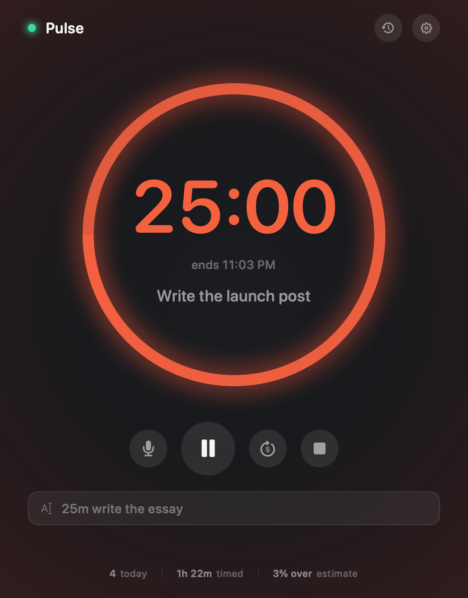
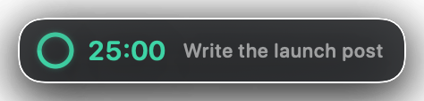
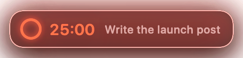
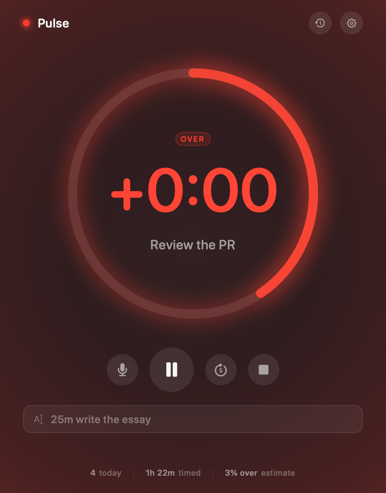
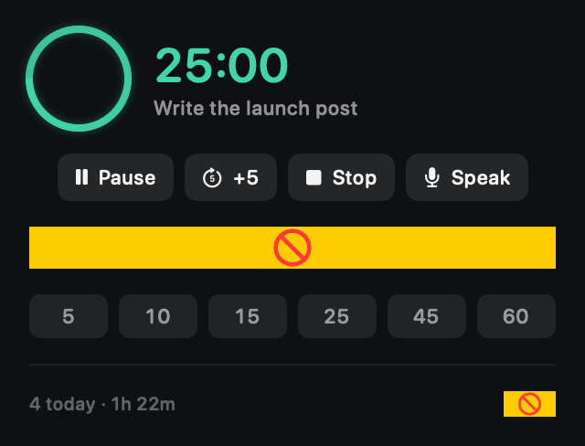

# Pulse

A timeboxing timer for macOS. You give yourself a length of time, and Pulse
keeps that number in front of you — quietly — until it runs out.



## The idea

Most timers only speak up twice: when you start them and when they go off. In
between you either stare at the clock or forget it exists.

Pulse warms to red for about a second and a half on every whole minute, then
cools back down. It's slow enough not to yank you out of what you're doing, and
bright enough that you register it out of the corner of your eye. It presses a
little harder over the last five minutes, harder still once you're past your
estimate.

The same beat runs everywhere at once — the window, the corner overlay, and the
menu bar all warm up together.

## Where it lives

Whenever the Pulse window isn't the thing you're looking at, a small pill parks
itself in the corner of the screen. It floats above everything, including other
apps in full screen, and never takes focus away from your work.




Hover it for controls — pause, add five minutes, stop, microphone — so you can
adjust the timer without leaving the app you're in. Drag it anywhere you like;
it stays there.

## Saying what you want

Press the microphone (or `⌃⌥⌘V` from any app) and say it in plain words.
Recognition runs on-device wherever the hardware supports it, so it works
offline and nothing is sent anywhere.

| You say | You get |
| --- | --- |
| "twenty five minutes to write the essay" | 25:00, labelled *Write the essay* |
| "half an hour" | 30:00 |
| "an hour and a half on the deck" | 1:30:00, labelled *Deck* |
| "ninety seconds" | 1:30 |
| "until 3pm" | however long that is from now |
| "pomodoro" | 25:00 |
| "add five minutes" | extends whatever is running |
| "pause" / "resume" / "stop" / "start over" | does that |

Everything above also works typed, in the field at the bottom of the window —
`25m write the essay`, `1h30 deep work`, `45`. A live read-back shows what it
understood before you commit.

## The rest of it

- **Counts past zero.** When time is up it keeps going in red, so you find out
  you ran eleven minutes over instead of guessing.
- **Learns how you estimate.** Every session is logged, and the history window
  tells you whether you habitually run over or under.
  
- **Menu bar countdown**, with a popover holding the full set of controls.
  
- **Full screen** for when you want nothing else on the display. The controls
  fade out after a few seconds and come back when you move the mouse.
- Optional: keep the display awake while timing, launch at login, hide the Dock
  icon and live in the menu bar alone.
- Honours Reduce Motion — the glow stays, the movement goes.

## Install

Requires macOS 14 or later.

```sh
git clone https://github.com/gitachi143/pulse-timer.git
cd pulse-timer
./Scripts/build-app.sh --install
```

That produces a universal (Apple silicon + Intel) `Pulse.app` and copies it to
`/Applications`. Leave off `--install` to just build it into `./build`.

The build is signed ad-hoc rather than with a Developer ID, so the first launch
needs the usual right-click → **Open**. Microphone and speech-recognition
permission are requested the first time you press the microphone, not at launch.

## Shortcuts

System-wide (no Accessibility permission needed):

| | |
| --- | --- |
| `⌃⌥⌘T` | start / pause |
| `⌃⌥⌘V` | speak a timer |
| `⌃⌥⌘P` | bring up the window |

In the window: `Space` start/pause · `⌘D` speak · `⌘.` stop · `⌘R` run again ·
`⌘⇧+` add five minutes · `⌃⌘F` full screen.

## Development

```sh
swift build          # build
swift test           # unit tests for the parser, timer maths and history
./Scripts/build-app.sh   # assemble Pulse.app
```

Two developer flags on the built binary:

```sh
./.build/debug/Pulse --selftest         # runtime checks: panel placement, menu bar, ticking
./.build/debug/Pulse --snapshot ./docs  # re-render the images in this README
```

Layout:

- `Sources/PulseKit` — the parts with no UI in them: the natural-language
  parser, the timer state machine, the session log. This is what the tests
  cover.
- `Sources/Pulse` — the app: SwiftUI views, the floating panel, the menu bar
  item, speech, global hot keys.

The timer derives its remaining time from a wall-clock deadline rather than
counting ticks, so it stays correct across sleep, app nap and a shut lid. Ticks
only exist to refresh the display, and the tick rate follows what's actually
visible — 60 Hz for the second and a half a pulse takes, and a lazy 0.2 s the
rest of the time.

## Licence

MIT.
